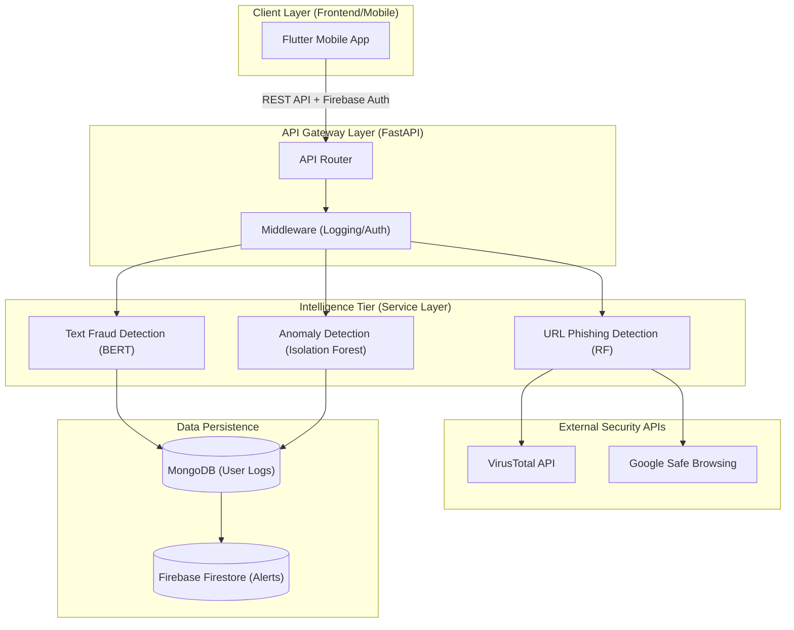

# 🛡️ Cyber AI System - Advanced Backend Infrastructure (v1.0.0)

Welcome to the core intelligence engine of the **Cyber AI System**. This backend is a high-performance, asynchronous FastAPI infrastructure designed to provide real-time threat detection, SMS fraud analysis, and user behavior anomaly monitoring.

---

## 🏗️ System Architecture (Advance++)



---

## 📂 Project Structure & Domain Mapping

```text
backend/
├── app/
│   ├── api/                # [PROTOCOL LAYER]
│   │   ├── routes/         # Endpoint definitions (REST)
│   │   └── deps.py         # Shared dependencies (Auth/DB)
│   ├── config/             # [CONFIGURATION MANAGEMENT]
│   │   ├── database.py     # Multi-DB Connection pools
│   │   └── settings.py     # Pydantic environment validation
│   ├── database/           # [PERSISTENCE LAYER]
│   │   ├── mongo.py        # Generic CRUD operations
│   │   └── collections.py  # Schema-defined collections
│   ├── models/             # [ARTIFACT STORE]
│   │   └── *.pkl           # Shared ML artifacts & weights
│   ├── schemas/            # [CONTRACT LAYER]
│   │   ├── request.py      # Request validation (Pydantic)
│   │   └── response.py     # Standardized JSON responses
│   ├── services/           # [LOGIC TIER]
│   │   ├── text_detection/ # BERT-based NLP services
│   │   ├── url_detection/  # URL vetting & external API calls
│   │   ├── anomaly/        # Stochastic behavior analysis
│   │   └── firebase/       # Messaging & Identity services
│   └── utils/              # Helper utilities
├── tests/                  # Unit & Integration test suites
├── .env.example            # Deployment environment template
├── Dockerfile              # Containerization specification
└── requirements.txt        # Dependency lockfile
```

---

## 🛑 Integration Protocols (Mandatory for Teams)

### 1. 📱 Mobile/Frontend Integration Rules
- **Authentication**: All protected routes require a `Bearer <Firebase_ID_Token>` in the `Authorization` header.
- **Request Format**: Strictly `application/json`.
- **Response Handling**: Follow standard HTTP Status Codes:
  - `422`: Schema validation error (check your request body).
  - `401/403`: Auth failure.
  - `500`: Server-side failure (auto-logged).
- **Polling**: Avoid polling for results; high-risk alerts are pushed via FCM (Firebase Cloud Messaging).

### 2. 🤖 ML Model Integration (ML Team)
- **Serialization**: Models must be exported using `joblib` or `pickle` (.pkl).
- **Versioning**: Artifacts should reside in `app/models/` and follow a `<model_name>_v<version>.pkl` naming convention.
- **Preprocessing**: All text cleaning logic must be synced with `app/utils/preprocessing.py` to ensure consistency between training and inference.

### 3. 🗄️ Database & Logging (Data Team)
- **Consistency**: All analysis results must be saved to MongoDB before returning a response to the client.
- **Indexes**: The `user_id` field in the `analysis_history` collection must be indexed for performance.
- **Atomicity**: Firebase Firestore is used for **Real-Time Social Proof/Alerts**, while MongoDB stores **Rich Analytics/History**.

---

## 🚀 Deployment Pipeline
This backend is designed to run in a containerized environment (Docker/Kubernetes).

```bash
# Build the production image
docker build -t cyber-ai-backend:v1.0 .

# Inject environment variables during runtime
docker run -p 8000:8000 --env-file .env cyber-ai-backend:v1.0
```

---

## 🔒 Security Standards
- **Encryption**: All external API keys must reside in `.env` and never be committed to Git.
- **Data Privacy**: No PII (Personally Identifiable Information) beyond `user_id` and message content is stored on local databases.
- **CORS**: Restricted to approved origins in production (via `app/main.py`).

---
*Created with ❤️ by the Cyber AI Backend developer - Vishal Deep*
